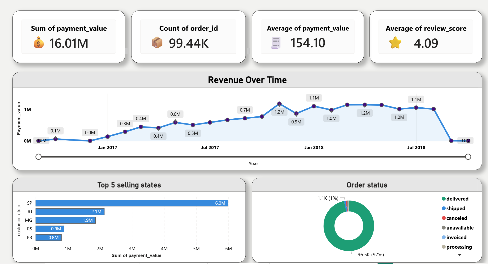

# Olist E-Commerce Analysis — Power BI Dashboard

An end-to-end data analysis project on the Olist Brazilian E-Commerce public dataset, covering data cleaning, modeling, and a 6-page interactive Power BI dashboard with business recommendations.



## 🚀 Interactive Report

The full interactive Power BI report (`olist-ecommerce-analysis.pbix`) is included in this repo. Download it and open it with the free [Power BI Desktop](https://www.microsoft.com/power-platform/products/power-bi/downloads) to explore every page, slicer, and filter yourself.

## 📊 Project Overview

This project analyzes ~100,000 orders from the Olist marketplace (2016–2018) to answer key business questions:

- What drives revenue, and which categories/states perform best?
- How does delivery speed affect customer satisfaction?
- Where are customers geographically concentrated?
- What payment behaviors should the business support better?

## 🗂️ Data Source

[Olist Brazilian E-Commerce Public Dataset](https://www.kaggle.com/datasets/olistbr/brazilian-ecommerce) — Kaggle, composed of 9 relational CSV files (customers, orders, order items, payments, reviews, products, sellers, geolocation, and category translations).

## 🛠️ Tools Used

- **Power Query (M)** — data cleaning, type correction, merging, and de-duplication across 9 tables
- **Power BI Desktop** — data modeling (relationships) and dashboard building
- **DAX** — calculated columns for delivery status and delivery time

## 🧹 Data Preparation

All 9 tables were cleaned and typed in Power Query, including:
- Correcting data types (dates, decimals, text IDs with leading zeros)
- Reducing the geolocation table from ~1M rows to ~19K by grouping on zip code
- Merging product categories with their English translations
- Fixing a hidden BOM character that broke column headers
- Adding a `Delivery Delay` duration column comparing actual vs. estimated delivery dates

Full breakdown of every transformation is in [`docs/Olist_Full_Project_Documentation.pdf`](docs/Olist_Full_Project_Documentation.pdf).

## 🔗 Data Model

A star-schema style model with `orders` as the central fact table, related to customers, order items, payments, reviews, products, sellers, and geolocation.

Two calculated columns were added via DAX:
```dax
Delivery Status =
IF(
    ISBLANK(olist_orders[Delivery Delay]),
    "Not Delivered",
    IF(olist_orders[Delivery Delay] < 0, "On Time", "Late")
)
```
```dax
Delivery Days = DATEDIFF(olist_orders[order_purchase_timestamp], olist_orders[order_delivered_customer_date], DAY)
```

## 📈 Dashboard Pages

| Page | Contents |
|---|---|
| **Overview** | KPIs, revenue trend, top 5 states, order status |
| **Sales Analysis** | Top 10 categories, payment methods, installment behavior |
| **Delivery Performance** | Slowest states, on-time vs. late rate, delivery trend over time |
| **Customer Satisfaction** | Rating distribution, delivery impact on ratings (year slicer) |
| **Geographic View** | Heat map of customer concentration across Brazil |
| **Key Findings** | Business recommendations derived from the analysis |

## 🔑 Key Findings

1. **Delivery is the #1 driver of satisfaction** — late orders average 2.8★ vs. 4.3★ for on-time orders.
2. **Sales are heavily concentrated in São Paulo** (R$6.0M vs. R$2.1M in the next closest state).
3. **Top categories** — health_beauty, watches_gifts, and bed_bath_table lead in sales.
4. **Credit card dominates payments** (73.9%) with the highest average installments (3.5).
5. The last two months of data (Sep/Oct 2018) appear incomplete and should be excluded from trend conclusions.

Full write-up with recommendations: [`docs/Olist_Full_Project_Documentation.pdf`](docs/Olist_Full_Project_Documentation.pdf)

## 📁 Repository Structure

---

## 👨‍💻 Author

**Abdelaziz Elshourbgy**

- GitHub: [AbdelazizElshourbgy-ui](https://github.com/AbdelazizElshourbgy-ui)
- LinkedIn: [abdelaziz-elshourbgy](https://www.linkedin.com/in/abdelaziz-elshourbgy-b126a83a2/)
